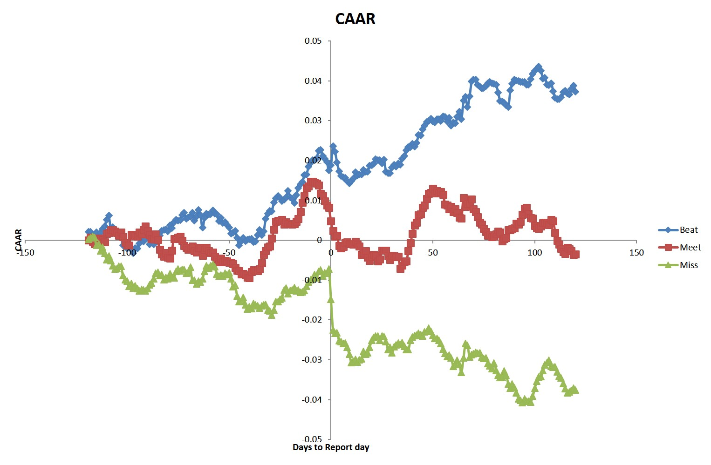

# Evaluate the Impact of Earning Report on Stock Prices

## Executive Summary  
  This project focuses on member stocks of Russell 1000 index and their EPS report in the 2nd quarter of 2017 to evaluate its impact on stock prices. 

  Generally, these stocks are divided by thir actual eps deviation from the estimated one into 3 groups. For each stock, libcurl is used to retrieve its 120 trading days' AR (Abnormal Return, calculated as access return) before and after the second quarter announcement date. After that, a bootstrapping method is implemented to calculate the CAAR (Cumulative Abnormal Average Returns in 240 trading days) of each group. Meanwhile, ExcelDriver is used to visualize 3 groups' CAAR time series in a plot to reflect intuitive earnings impacts. Also a menu in command line is given to show the whole process.
  
## Library Files 
  * libcurl
  * ExcelDriver

## Project Outline
  1. Data Preprocessing
  	Actual EPS, estimated EPS and announcement date of RIY1000 member stocks in 2017Q2 are downloaded in excel from Bloomberg terminal. Also, stocks with missing data are deleted. And we the final list of stocks are in .xls.   

  2. Group Division
    Define the percentage of a stock's actual eps deviation from the estimated one to be **EPS surprise ratio**, and we can divide these stocks by their **EPS surprise ratio** into 3 groups called **"beat"**, **"meet"** and **"miss"** (where **beat** group stocks have the highest **EPS surprise ratio** about 5% ~ 10%). To keep the uniform property of sampling in bootstrapping, these groups must be equally divided. The details are in **Divide.cpp** file.  
  
  3. Historical Data Retrieving
	  For each stock's 120 trading days' AR before and after the second quarter announcement date, libcurl (a library using cookies and crumbs to access pages) is used to retrieve them. Also, this is performed in a multithreading way. The details are in **Stock.cpp** file.

  4. Bootstrapping
  	A class called Bootstrap is created to do the sampling and CAAR calculation work. Once an instance of Bootstrap class is created, it will automatically do 5 times of sampling within these 3 groups, calculate and store their CAAR in a STL vector.

  5. Visualize EPS Impacts
  	ExcelDriver is used to visualize 3 groups' CAAR time series.

  6. Menu Design
    A command line menu is given to show the process of division, data retrieving, bootstrapping and visualizing. 

  7. Conclusion
	  From , We can draw the conclusion that EPS will have extra impacts on a stock over its benchmark (positive for **"beat"**, neutral for **"meet"** and **"negative"** for “miss”).